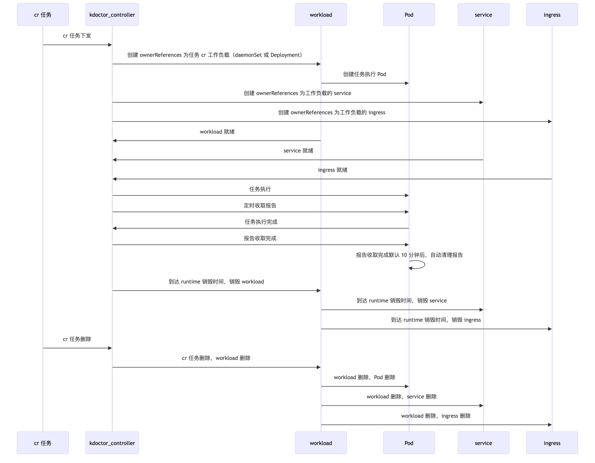

## runtime

[**English**](./runtime.md) | **简体中文**

部署 kdoctor 后，会创建一个默认任务载体（Daemonset），当下发任务 CR 后，kdoctor-controller 会根据 CR 中的是否定义 AgentSpec 字段选择生成对应的任务载体（DaemonSet 或 Deployment）或使用默认的载体资源，当所有 Pod 就绪后，开始按照 Spec 中的任务定义执行任务。

### 载体资源

当任务 CR 下发后，kdocotr-controller 会创建或复用如下资源执行任务。

### 工作负载

1. 默认工作负载
    > 默认工作负载（DaemonSet）在部署 kdoctor 后生成，在未定义 AgentSpec 时，使用此载体执行任务，此载体不会因为任务删除或结束而被删除。
    
    > 因所有使用默认工作负载的任务都会在此负载中执行，因此适合请求量较少，资源使用较少的任务。  

2. 新建工作负载
    > 工作负载为 DaemonSet 或 Deployment，默认为 DaemonSet，负载中的每一个 Pod 根据任务配置执行请求，并将执行结果落盘到 Pod 中，可通过 AgentSpec 中设置
    工作负载的销毁时间，默认任务执行完 60 分钟后，销毁工作负载，当删除 CR 任务时，工作负载会一并被删除。

    > 此工作负载单独执行一个任务，因此与其他任务的资源使用是隔离的，适合请求量较大，资源消耗较大的任务。 

### Service

1. 默认工作载体 Service
    >与默认工作负载一样，在部署 kdoctor 后生成，与默认负载关联且不会因为任务删除或结束而被删除。
2. 新建工作载体 Service
    >在创建工作负载时，kdoctor-controller 同时会根据 IP Family 的配置，创建对应的 service 与工作负载的 Pod 绑定。用于测试 service 网络连通性。与工作负载的销毁逻辑相同。

### Ingress

1. 默认工作载体 Ingress
   >与默认工作负载一样，在部署 kdoctor 后生成，与默认负载 service 关联且不会因为任务删除或结束而被删除。
2. 新建工作载体 Ingress
   >当任务为 NetReach 时，若测试目标包含 Ingress 时，会创建一个 Ingress，用于测试 Ingress 的网络联通性，与工作负载的销毁逻辑相同。
   

### 报告收取

当任务 CR 下发后，kdoctor-controller 会将任务注册进 ReportManager，ReportManager 会定期去每一个任务负载中通过 GRPC 接口获取报告，并聚合
在 kdoctor-controller 中，聚合后可通过命令 `kubectl get kdoctorreport` 获取报告结果，因此，若报告未收集完成就将工作负载删除将影响报告聚合结果。

###  生命周期

* 任务开始后，kdoctor-controller 会定时向任务中的 Pod 收取报告，任务完成后，报告收集完成，不会再进行报告收集。
* 任务负载执行完任务后，报告被 kdoctor-controller 收取报告默认 10 分钟后，会自动清理掉负载中的报告。
* 当删除掉已经完成的任务 CR 后，报告依然存在 kdoctor-controller 报告目录下，但无法通过 k8s 聚合 api 查看，需要手动才能进行查看。
* 当删除执行中的任务 CR 时，任务会终止，创建 CR 时生成的资源会一并删除，已经收集好的报告依然存放在 kdoctor-controller 报告目录下。