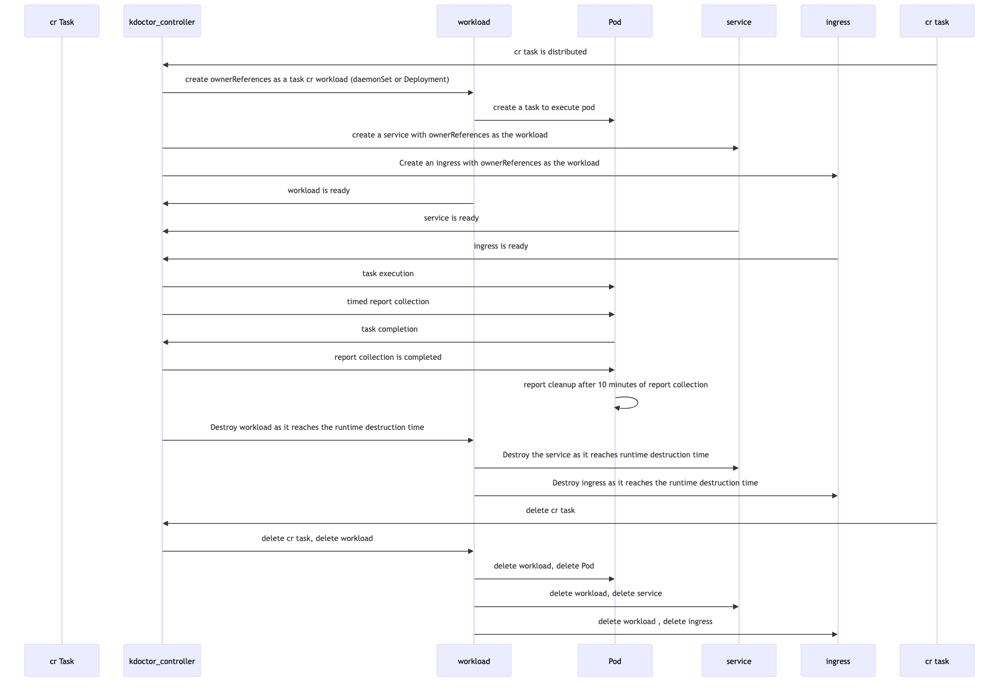

## Runtime

[**简体中文**](./runtime-zh_CN.md) | **English**

After deploying kdoctor, a default task carrier (Daemonset) will be created. When a task CR is delivered, kdoctor-controller will choose to generate the corresponding task carrier (DaemonSet or Deployment) or use the default carrier resources based on whether or not the AgentSpec field is defined in the CR. When all Pods are ready, they start executing tasks according to the task definitions in the Spec.

### Carrier Resources

When a task CR is delivered, kdoctor-controller creates or reuses the following resources to execute the task.

### Workloads

1. Default workload
    > The default workload (DaemonSet) is generated after kdoctor is deployed and is used for executing tasks when no AgentSpec is defined; this carrier is not deleted for task deletion or termination.
    > Since all tasks that use the default workload will be executed in this workload, it is suitable for tasks with fewer requests and less resource usage.  
2. New workload
    > The workload is DaemonSet or Deployment, and the former is the default. Each Pod in the workload executes the request according to the task configuration and drops the execution result to the Pod. Destruction time of the workload can be set in AgentSpec.
    By default, the workload will be destroyed after 60 minutes of task execution. When the CR task is deleted, the workload will be deleted  as well. 

    > This workload executes a task alone, so it is isolated from the resource usage of other tasks, which is suitable for tasks with a large number of requests and resource consumption. 

### Service

1. Default workload Service
    > Same as the default workload, it is generated after deploying kdoctor, associated with the default workload, and will not be deleted when a task is deleted or terminated.
2. New workload Service
    >When creating a workload, kdoctor-controller will create a corresponding service and bind it to the Pod of the workload according to the IP Family configuration. This is used to test the service network connectivity, which is the same logic as workload
    destruction logic.
### Ingress

1. Default workload Ingress
   > The default workload Ingress is generated after deployment of the kdoctor and is associated with the default workload service and will not be deleted when the task is deleted or terminated, as is the case with the default workload.
2. New workload Ingress
   >When the task is NetReach and the test target contains an Ingress, an Ingress is created to test the network connectivity of the Ingress, with the same destruction logic as the workload.

### Report Collection

When the task CR is delivered, kdoctor-controller will register the task into ReportManager. ReportManager will periodically go to each task workload to get the report via GRPC interface and aggregate the reports into the kdoctor-controller.
In kdoctor-controller, after aggregation, you can get the report result by command `kubectl get kdoctorreport`. Therefore, if you delete the workload before the report is collected, it will affect the report aggregation result.

### Lifecycle

* After a task is started, kdoctor-controller collects reports from the Pods in the task at regular interval. After the task is completed, report collection is complete and no further report collection will be performed.
* After the workload execute the task, the reports are collected by the kdoctor-controller. By default, after 10 minutes, the kdoctor-controller automatically cleans up the reports from the workload.
* When a completed task CR is deleted, the report still exists in the kdoctor-controller report directory. However, it cannot be viewed through the k8s aggregation api and needs to be viewed manually.
* When deleting an executing task CR, the task will be terminated, and the resources generated during the creation of the CR will be deleted, and the collected reports will still be stored in the kdoctor-controller report catalog.